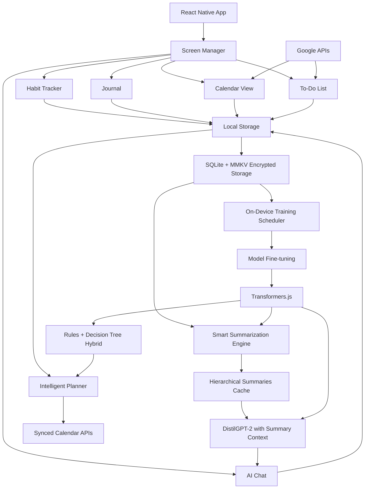

# 🌟 Shifu : Target Architecture

> **⚠️ This document describes the _final, fully-realised_ architecture that Shifu is being built
> towards.** It is not a reflection of the current implementation state. Many subsystems described
> here (e.g. hierarchical summarization, nightly training pipeline, on-device MLOps) are planned but
> not yet implemented. For current progress and what has been completed, see
> **[ROADMAP.md](ROADMAP.md)**.

This document serves as the single source of truth for the **Shifu** project, defining a
definitive target architecture that meets the core mandate: **100% On-Device Functionality with Zero
Company-Run Servers**.

## I. System Overview and Mandate

Shifu is a React Native application (Android + iOS) designed from the ground up
for **offline-first** operation with sophisticated AI capabilities, rooted in the Wu Xing (Five
Elements) philosophy. It functions as a fully self-contained, intelligent life manager that operates
without compromise to user privacy or data sovereignty.

The front-end is built with React Native (0.72) and Expo for optimal cross-platform development,
utilizing a local SQLite database for all data storage. Combined with Zustand (a ~2KB state store
[1]) for state management, this architecture guarantees the app “will work offline without any extra
effort” [2]. React Native’s Hermes engine is used to compile JavaScript ahead-of-time, improving
startup time and reducing memory usage [3].

Third-party integration, such as with Google Calendar or Tasks, is implemented via direct,
client-side **OAuth 2.0**. Authentication tokens are stored locally, and API calls are made only
when a network is available. Critically, this synchronization is an optional layer; the app's core
functionality—task tracking, habit management, and AI-powered scheduling—remains fully operational
offline.

### 1.1 Core Mandate: Local-First, Privacy-by-Design

The project's foundational mandate is uncompromising: the application must be 100% local-first. No
user data is ever transmitted to company servers for core processing.

1. **Zero Server Deployment for Core Features:** The development entity **will not operate any
   backend servers** for the application's primary functionality. All data processing, schedule
   optimization, and AI inference (including model fine-tuning) occurs exclusively on the user's
   device.

2. **Minimal and Optional External Communication:** The **only** external network communication
   permitted is the optional, user-authorized synchronization with third-party services (e.g.,
   Google or Apple calendars) via client-side OAuth 2.0. This feature can be disabled entirely,
   resulting in a completely network-isolated application.

3. **Absolute Data Sovereignty:** All user data resides **solely** within the app's sandboxed
   storage on the user's device. It is protected by AES-256 encryption at rest and is never exported
   without explicit user action.

#### Local-First Implementation Details

- **Offline Data Layer:** We use SQLite (via `expo-sqlite`) as a lightweight, serverless relational
  database on-device. SQLite is a C library optimized for offline use and comes built-in on mobile
  platforms, requiring no setup [2] [4]. It loads only needed data (rather than whole datasets) at
  runtime, improving performance and minimizing memory footprint.
- **Key-Value Storage:** For simple, performance-sensitive data (settings, feature flags, cache), we
  use MMKV (via the `react-native-mmkv` library). MMKV uses a native C++ implementation and JSI for
  synchronous access, yielding _exceptional_ speed – on the order of ~30× faster reads/writes than
  AsyncStorage [5]. This performance gain (and low overhead) makes MMKV ideal for frequently
  accessed small data.
- **In-Memory State:** We use **Zustand + TypeScript** for global state. Zustand is a minimalist
  store with a tiny bundle (~2KB gzipped) [1], adding negligible overhead while still providing
  reactive state updates. It avoids Redux’s boilerplate and has excellent performance for mobile.
- **JS Engine (Hermes):** React Native’s default Hermes engine compiles JS to bytecode at build
  time. This means code is loaded into memory on-demand without parsing, drastically improving
  startup time and reducing peak memory usage:contentReference [3] [6].

### 1.2 Vision: The Intelligent, Adaptive Edge

The product's unique value is its **deeply personalized intelligence**, enabled by sophisticated
on-device AI systems that learn and adapt to the individual user.

- **The Coach / AI Secretary:** A contextual AI chatbot that provides nuanced feedback and guidance
  by accessing the user's entire historical context (including journal entries, habit
  success/failure patterns, task completion history, etc.). Powering this is an advanced **Local
  Retrieval-Augmented Generation (RAG) pipeline**, enhanced by a novel **hierarchical summarization
  system**. This system automatically condenses daily logs into weekly, monthly, and quarterly
  summaries, allowing the Coach to identify long-term patterns and provide insightful counsel with
  minimal computational overhead.
- **The Intelligent Scheduler:** An adaptive hybrid system combining rule-based logic (informed by
  Wu Xing philosophy and user preferences) with a non-linear ML model. It analyzes the user’s past
  performance, diurnal energy cycles, and task contexts to generate realistic, optimized daily
  schedules. The system implements a continuous on-device MLOps feedback loop: completions,
  reschedules, and journal ratings become training data. A **nightly training pipeline**, activated
  only when the device is charging and idle, fine-tunes the scheduler model (using efficient
  decision tree ensembles) to better reflect the user's unique productivity rhythms.

To achieve this vision entirely on-device, the app leverages a modern edge-AI stack.
**Transformers.js** (Xenova) runs quantized ONNX models directly within the React Native environment
via WebAssembly/JSCore. We use compact models (e.g., Decision Tree ensemble ~5MB, DistilGPT-2
dialogue model ~150MB) that are **quantized** (4-bit/8-bit) to minimize memory and computation [9].
A separate distilled language model and an embedding model power the RAG system. All models are
lazy-loaded, cached, and managed within a local registry to respect device constraints and ensure
smooth performance.

## **II. Modular Edge AI Architecture**

The system runs fully on-device but is structured as a set of modular subsystems—UI, storage,
summarization, vector indexing, training scheduler, and inference runtime—each with clearly defined
responsibilities. While the app resides in a single codebase, its internal architecture is
**service-like and decoupled**, avoiding the pitfalls of a monolith.



### 2.1 Technical Stack

Shifu can run 100% offline using a React Native foundation enhanced with lightweight transformer
models and a local-first storage system. Its technical stack blends AI runtimes, background
automation, and encrypted persistence to deliver a fast, private, and offline-ready personal
planning experience.

| Layer                        | Technology                                        | Rationale & Mandate Alignment                                                                                                                                                                               |
| ---------------------------- | ------------------------------------------------- | ----------------------------------------------------------------------------------------------------------------------------------------------------------------------------------------------------------- |
| **Application**              | **React Native 0.72 + Expo SDK 49**               | Core cross-platform UI. Expo simplifies deployment and native integrations. React Native leverages Hermes by default for performance [3].                                                                   |
| **JavaScript Engine**        | **Hermes**                                        | Hermes compiles JavaScript to bytecode at build time, improving startup performance and reducing memory overhead [3] [6].                                                                                   |
| **UI Components**            | **NativeBase 3.4**                                | Comprehensive, accessible, themeable component library with strong dark-mode support.                                                                                                                       |
| **Navigation**               | **React Navigation 6**                            | Industry-standard navigation library. Provides native-like transitions and performance.                                                                                                                     |
| **State/Type Safety**        | **Zustand + TypeScript**                          | Ultra-lightweight state manager (~2KB gzipped [1]) with a simple hook API. Eliminates Redux boilerplate with minimal overhead.                                                                              |
| **Local Database**           | **SQLite** via `expo-sqlite`                      | ACID-compliant relational DB. SQLite is self-contained and serverless, optimized for on-device/offline use [2] [4].                                                                                         |
| **Key-Value Store**          | **MMKV** (primary) + **AsyncStorage**             | MMKV is a native C++-backed store (via JSI) that is ~30× faster than AsyncStorage [5], ideal for config and cache. AsyncStorage is only used for trivial data.                                              |
| **Vector DB / Index**        | **ChromaDB**                                      | Specialized vector database for embeddings. Handles similarity search and clustering efficiently.                                                                                                           |
| **AI Inference**             | **Transformers.js (Xenova)**                      | Runs quantized ONNX models (e.g., decision tree ensembles, DistilGPT-2) on-device via WebAssembly/JS. Models are quantized (4/8-bit) to reduce memory [7]. No server needed.                                |
| **AI Processing**            | **Custom Prompt Engineering + Summary Hierarchy** | Hierarchical summarization (daily→weekly→monthly→quarterly) dramatically reduces RAG context size. Custom prompt templates (via LangChain.js or similar) structure queries and context efficiently.         |
| **Local Training Framework** | **TensorFlow.js (Decision Trees) + ONNX Runtime** | On-device fine-tuning of scheduling models using lightweight decision-tree ensembles. We constrain ONNX to single-thread (WASM) on mobile to avoid known concurrency issues [8].                            |
| **MLOps/Model Mgmt**         | **Custom Logic + Nightly Scheduler**              | SQLite-backed Model Registry with versioning. Nightly training tasks only run under optimal conditions (charging, >80% battery, idle) [9] [10]. A local A/B test ensures only improved models are deployed. |
| **Performance Monitoring**   | **Custom Telemetry + Device Tier Detection**      | Real-time FPS, memory, battery and inference time logging. Detect device capability tier (low/medium/high) to adjust AI feature usage dynamically.                                                          |
| **Integrations**             | **Google APIs, Expo Notifications**               | Client-side OAuth flows for calendar/task sync. Native push notifications managed by Expo. No data is sent through our servers.                                                                             |
| **Graphics**                 | **React Native SVG + Reanimated 2**               | Hardware-accelerated vector graphics. All animations (Wu Xing clock, transitions) use the native animation driver to maintain 60fps performance.                                                            |
| **External Sync**            | **Expo Libraries / Google Native SDKs**           | OAuth 2.0 flows executed entirely on-device. Data is synced directly between the app and user’s cloud accounts (no intermediary backend).                                                                   |

### 2.2 Screen Architecture & State Management

The frontend architecture utilizes a standardized pattern for all screens to ensure consistency and
maintainability.

#### Base Screen Structure

All major screens inherit from a `BaseScreen` class or component, encapsulating common concerns:

```javascript
class BaseScreen extends React.Component {
  // Common functionality for all screens:
  // - Loading states management
  // - Global error handling (toasts/modals)
  // - Theme support and application of styles
  // - Integration with React Navigation 6 lifecycle hooks
}
```

#### State Management with Zustand

**Zustand** is selected as the global state manager for its simplicity, performance, and small
bundle size, replacing the initial proposal of Redux Toolkit. State is managed via distinct, small
stores:

```javascript
// Global stores using Zustand
const useHabitStore = create((set, get) => ({
  habits: [],
  loadHabits: async () => {
    /* ... load from SQLite*/
  },
  toggleHabit: async habitId => {
    /* ... update habit status */
  },
  // ... other habit-related actions and state
}));
```

### 2.3 Local Data Storage Strategy

The data layer is multi-faceted to optimize for both relational complexity and high-speed access:

1. **SQLite:** Used for all complex, relational user data (Habits, Tasks, Journal Entries, Vector
   Embeddings). This provides strong consistency and efficient queries offline. SQLite is a
   self-contained serverless engine well-suited to mobile devices [2] [4].

2. **MMKV (Key-Value Store):** Used for performance-critical, non-relational data such as user
   preferences, feature flags, and cached settings. MMKV’s native-memory design yields extremely
   fast reads/writes [5], far outpacing AsyncStorage.

3. **AsyncStorage:** Reserved for legacy or trivial key-value needs that don't warrant MMKV’s speed.

4. **AES-256 Encryption:** All sensitive data in SQLite and MMKV is protected with AES-256 at rest,
   aligning with enterprise security best practices.

### 2.4 Performance & Optimization

Given the app's reliance on on-device AI models and a rich feature set, performance and efficiency
are paramount, especially on lower-end devices.

#### Code & Asset Loading

- **Lazy Loading:** Models (T5, DialoGPT, etc.) and heavy screens are lazy-loaded only when needed.
  We use dynamic `import()` or `React.lazy()` so that adding features doesn't bloat the initial JS
  bundle [6].

- **Hermes Bytecode:** With Hermes as the JS engine, code is precompiled to bytecode at build time.
  This means app startup skips JS parsing, loading bytecode on demand and lowering memory use [3]
  [6].

- **Caching:** AI inference results (e.g., RAG context embeddings, generated schedules) are cached
  in MMKV when possible, avoiding redundant computations.

#### Background Processing

- **Nightly Scheduler:** Schedule generation and training run as background tasks (via Expo
  TaskManager). We only allow these when the device is charging and battery is high [9] [10], in
  line with WorkManager/BGTaskScheduler best practices. This ensures heavy work is deferred until
  the device is idle and power-rich [10] [11].

- **Task Phasing:** The nightly pipeline phases tasks by priority. Critical updates (DB integrity,
  encryption checks) run first. Training and summaries only proceed if earlier steps succeed. Long
  tasks are broken into smaller chunks.

#### Memory Management

- **Model Unloading:** Large models are explicitly unloaded when screens are closed to free memory.
  On very low-memory devices, only one model is kept in RAM at a time.

- **Image Optimization:** All static assets are optimized (compression, appropriate sizing). Vector
  icons (SVG) and hardware-accelerated animations minimize image memory.

- **List Virtualization:** All long lists (habits history, tasks, journal logs)
  use `FlatList`/`SectionList`. These virtualized lists detach off-screen items from the view
  hierarchy, significantly reducing memory and render workload [12]. We tune `windowSize` and other
  props so that only a small number of items are mounted at once.

#### CPU & Energy

- **Adaptive Inference:** The app adapts its AI workload to the device's capability. On lower-end
  devices, we may use smaller context windows, simpler models, or disable some non-critical AI
  features to keep the UI responsive.

- **Efficient ML Models:** We favor lightweight models. The Scheduler uses decision-tree ensembles
  (no iterative training loop), and we use small transformer variants (e.g. T5-small, DistilGPT-2)
  that are quantized to 4/8 bits [7]. This greatly cuts down both parameter count and compute
  without a large accuracy hit.

- **Single-threaded ML:** ONNX Runtime (used by Transformers.js) is configured to run in
  single-thread mode on mobile to avoid concurrency overhead and known multi-threading bugs [8].

- **Hardware Offload:** Where applicable (e.g. image recognition tasks), we use WebGPU acceleration.
  For core NLP tasks, we rely on optimized WebAssembly.

### 2.5 Memory-Efficient Summary Hierarchy Implementation

To save tokens and computation we do not enter 365 journal entries, but rather 3 journal entries, 3
weekly summaries, 3 montly summaries and 3 quarterly summaries. This requires and extra model which
does the summarizing, and for the program to maintain:

**Data Structure:**

```sql
-- Summary hierarchy tables
CREATE TABLE daily_summaries (
  id TEXT PRIMARY KEY,
  date TEXT,
  content TEXT,
  embedding BLOB,
  mood_score REAL,
  productivity_score REAL,
  key_insights TEXT  -- JSON array of key points
);

CREATE TABLE weekly_summaries (
  id TEXT PRIMARY KEY,
  week_start TEXT,
  daily_summary_ids TEXT,  -- JSON array of references
  content TEXT,
  embedding BLOB,
  trends TEXT,  -- JSON: {"productivity_trend": "up", ...}
  recommendations TEXT
);

-- Similar for monthly and quarterly summaries

```

**Update Schedule:**

- **Daily:** 23:00 (after last journal entry)

- **Weekly:** Sunday 23:30

- **Monthly:** Last day of month 23:45

- **Quarterly:** End of quarter 00:00

**Memory Optimization:**

- Only keep 3 most recent summaries of each type in active memory

- Older summaries archived to compressed format

- Vector embeddings for old summaries stored in lower precision (16-bit floats)

### 2.6 Enhanced Local Retrieval-Augmented Generation (RAG) Pipeline

The RAG pipeline is enhanced with a **hierarchical summarization system** that enables the Coach to
provide personalized advice with 10x faster response times while maintaining context depth.

1. **Embedding Generation with Multi-Resolution:** User data is processed at multiple levels:
   - **Raw Level:** Individual journal entries, task completions (stored as vectors)
   - **Summary Level:** AI-generated summaries (daily→weekly→monthly→quarterly)

2. **Intelligent Vector Storage:**
   - Primary vectors stored in **ChromaDB**
   - **Summary vectors** also stored in ChromaDB collections
   - Efficient similarity search provided by ChromaDB

3. **Hierarchical Retrieval Process:** When the user prompts the Coach, the query is immediately
   embedded, then a Multi-Level Search:
   1. **Check summary cache:** (3 days + 3 weeks + 3 months + 3 quarters = 12 documents)
   2. **Fallback to Raw Data:** If there is insufficient context, then the system then performs a
      fast **cosine similarity search** against the local Vector Index to retrieve the top-K
      relevant historical data points (journal text, failure logs, etc.).
   3. **Hybrid approach:** Broad patterns from summaries, specifics from raw data

4. **Context-Aware Orchestration:** Custom orchestration layer that:
   - Determines query complexity (simple → use summaries, complex → use raw)
   - Manages context window efficiently (max 2048 tokens)
   - Implements conversation memory with summary-based compression
   - **LangChain.js** or a similar custom library is used to structure the final prompt, combining:
     - System Instructions (The Coach's persona and rules).
     - Retrieved Context (The historical data from the local Vector Index).
     - User Query (The user's question).

### 2.7 Intelligent Scheduler with Non-Linear Learning (On-Device MLOps)

The Scheduler employs a **hybrid intelligence approach** combining rule-based foundations with
adaptive machine learning that captures non-linear, context-dependent patterns.

**Hybrid Architecture:**

1. **Rule-Based Foundation Layer:**
   - Wu Xing phase rules (creativity in Fire, organization in Metal)
   - User preferences (no meetings before 10:00, etc.)
   - Calendar constraints (fixed events, work hours)

2. **Machine Learning Layer (Decision Tree Ensemble):**
   - **Decision Trees** capture "if-then" rules from user behavior
   - **Random Forest** ensemble (10-50 trees) for robust predictions
   - **Gradient Boosting** learns from scheduling mistakes over time
   - **Feature Engineering:** 50+ features including time of day, day of week, previous task
     success, energy levels, weather impact

3. **Reinforcement Learning Feedback Loop (Advanced):**
   - Each day is an "episode" with successful scheduling as reward
   - Learns optimal task sequencing through trial and error
   - Adapts to user's changing rhythms and preferences

### 2.8 Weekly Fine-Tuning for the Scheduler (On-Device MLOps)

A critical component of the **Intelligent Edge** is the localized Machine Learning Operations
(MLOps) pipeline, enabling the Scheduler model to adapt to the individual user's performance and
habits over time.

1. **Data Preparation and Versioning:** User completion/failure data and journal ratings from the
   past week are pulled from the local **SQLite database**. This data forms the training dataset.
   The training set's schema and version are tracked within a dedicated metadata table in the SQLite
   database (the local **Model Registry**).

2. **Feature Extraction and Augmentation:** A **JS Feature Extraction Pipeline** performs
   normalization and augmentation on the local data (e.g., creating time-of-day features, success
   streaks) before it is fed into the training job.

3. **Training Job Scheduler:** A Training Job Scheduler (a timed mobile background task)
   automatically triggers the fine-tuning process, for example, weekly or upon hitting a specified
   performance metric threshold (low scheduling effectiveness).

4. \***\*Incremental Training:** We fine-tune the existing scheduler model (e.g., a small T5 or a
   tree ensemble) using TensorFlow.js. Because our models are small, on-device training finishes in
   seconds/minutes.

5. \***\*Versioning & Deployment:** New model weights are saved locally and registered. A quick
   local **A/B test** (e.g., simulated schedule vs. previous model) ensures only improvements are
   kept. If good, the new model replaces the old.

### 2.9 Nightly Maintenance System

Every night the day must be summarised, possibly so too the week or the month. Beyond that there is
weekly fine-tuning to be done. A typical night will look like:

```
23:00 - Device detects charging + idle
23:05 - Check battery >80% + temperature <40°C
23:10 - Prepare training dataset from past 30 days
23:15 - Feature extraction and normalization
23:20 - Incremental model training (decision tree updates)
23:30 - Model validation against recent performance
23:35 - A/B testing: compare new vs old model
23:40 - Deploy if improvement >2.5%
00:00 - Cleanup and model compression
```

**Intelligent Scheduler Conditions:**

- **AND Conditions:** Charging + Battery >80% + Idle (no touch input for 15min) + Time (02:00-05:00)

- **OR Conditions:** Manual trigger + Charging

- **Never:** When device temperature >45°C or battery <50%

**Maintenance Tasks (Prioritized):**

1. **Critical:** Database integrity check, encryption verification

2. **High:** Summary generation, model training (if data >7 days old)

3. **Medium:** Vector index optimization, cache cleanup

4. **Low:** Old data archiving, log rotation

**Failure Recovery:**

- Failed training attempts logged and retried next night

- Corrupt models automatically reverted to last stable version

- User notified only after 3 consecutive failures

### 2.10 Project File Structure

```
harmonious-day/
├── .github/workflows/          # CI/CD (mobile-tests.yml, linting)
├── README.md                   # Project overview
├── docs/                       # Project Documentation
│   ├── ARCHITECTURE.md         # This document
│   ├── DESIGN.md               # UI/UX specifications
│   └── ROADMAP.md              # Optimization guidelines
│
├── src/                        # Core application
│   ├── navigation/             # React Navigation setup
│   ├── screens/                # UI screens per DESIGN.md
│   ├── services/
│   │   ├── data/               # Data processing services
│   │   │   ├── Anchors.ts      # Solar/prayer time calculations
│   │   │   ├── Calendar.ts     # Calendar event processing
│   │   │   ├── Tasks.ts        # Task urgency filtering/processing
│   │   │   ├── Habits.ts       # Habit tracking logic
│   │   │   └── Summarizer.ts   # Hierarchical summary engine
│   │   ├── ai/
│   │   │   ├── AIServiceManager.ts    # Model lifecycle management
│   │   │   ├── RAGEngine.ts           # Enhanced RAG with summary hierarchy
│   │   │   ├── SchedulerAI.ts         # Hybrid scheduler (rules + ML)
│   │   │   ├── TrainingScheduler.ts   # Nightly training orchestration
│   │   │   └── ModelRegistry.ts       # Local model version management
│   │   ├── performance/
│   │   │   ├── DeviceTier.ts          # Device capability detection
│   │   │   ├── MemoryManager.ts       # Smart memory management
│   │   │   └── BatteryOptimizer.ts    # Power-aware operations
│   │   └── sync/
│   │       └── ExternalSyncService.ts # OAuth 2.0 and API integration
│   ├── db/
│   │   ├── database.ts         # SQLite setup and migrations
│   │   ├── schema.ts           # Database schema (Habits, Tasks, Summaries, Vectors, ModelRegistry)
│   │   └── vectors.ts          # Vector storage and ANN index management
│   ├── models/
│   │   ├── types.ts            # TypeScript interfaces
│   │   ├── rules/              # Rule-based scheduling rules
│   │   └── ml/                 # Machine learning model definitions
│   ├── components/             # Reusable UI components
│   └── utils/                  # Utility functions
│       ├── encryption.ts       # AES-256 encryption utilities
│       ├── telemetry.ts        # Performance monitoring
│       └── offline.ts          # Offline capability utilities
│
├── assets/                     # Static assets
│   ├── fonts/                  # Custom fonts
│   └── images/                 # Optimized images
├── models/                     # Quantized AI models (downloaded on first run)
│   ├── scheduler-dtree.onnx    # Decision tree ensemble (5MB)
│   ├── coach-dialogpt.onnx     # Dialogue model (150MB)
│   ├── embeddings-minilm.onnx  # Embedding model (80MB)
│   └── metadata.json           # Model metadata and version info
├── tests/                      # Test suite
└── package.json
```

### 2.11 Energy & Resource Efficiency

We enforce strict policies to minimize CPU, memory, and battery usage:

- **Charging & Idle Only:** All heavy tasks (summarization, training, indexing) run only when the
  device is plugged in or has high battery [9] [10]. Expo’s background task system respects these
  constraints, deferring work until the device is idle and power-rich.

- **Smart Scheduling:** Background tasks specify minimum intervals and platform constraints. On iOS,
  BGTaskScheduler will schedule the next run (often late night). On Android, WorkManager constraints
  (charging, battery >50%) prevent undue drain.

- **Monitoring & Throttling:** We monitor runtime metrics (CPU, temp). If the device is busy or hot,
  we pause or slow background AI tasks. The app dynamically throttles itself based on current
  conditions.

- **Hermes & Inline Requires:** Leveraging Hermes ahead-of-time compilation and React Native's
  inline `require()` optimizations reduces initial JS work [3] [6]. Large modules are only loaded
  when first needed, which smooths startup and lowers peak CPU.

- **Reduced Motion Mode:** If the user or system requests reduced motion (or a battery saver), we
  disable decorative animations (clock pulse, confetti) and use simpler transitions. This respects
  accessibility settings and conserves energy.

### 2.12 Critical Dependencies and Versioning

- **Model Sizes:** ONNX models are quantized 4-bit/8-bit to minimize disk and RAM usage [7]. We
  limit total model storage by device tier; future updates may include even smaller models (2-bit)
  as quantization tech matures.

- **Library Footprint:** We carefully vet all third-party libs. For example, NativeBase provides UI
  components in ~few KB each, and Zustand’s core is ~2KB [1]. We avoid bulky libraries; e.g. we
  chose mmkv over larger DB solutions for its slim profile.

- **Telemetry:** All performance metrics (FPS, memory, battery) are logged locally. We
  do *not* include any third-party analytics SDKs, so the app performs no hidden network calls for
  telemetry.

### 2.13 Security & Fail-Safes

- **Encryption Key:** A device-unique passcode (or biometric seed) is used to derive an AES-256 key
  via PBKDF2. This key encrypts the SQLite and MMKV data. Keys never leave the device.

- **Crash Resilience:** We wrap model loads and inferences in try/catch. If an on-device training
  run fails or OOM occurs, we roll back to the last working model. Users are notified only if a
  failure persists across multiple nights.

- **User Control:** In Settings, users can disable AI features (Coach, scheduling optimization) and
  background sync. This ensures the app can run in a minimal “offline” mode if desired, preserving
  strict privacy and low resource use.

---

React State Management 2025: Redux,Context, Recoil & Zustand

[1]
https://www.zignuts.com/blog/react-state-management-2025#:~:text=Zustand%27s%20Elegant%20Simplicity%3A

Choosing the Right Database for React Native Apps

[2]
https://www.clariontech.com/blog/right-database-for-react-native-app#:~:text=In%20mobile%20applications%2C%20SQLite%2C%20a,any%20developer%27s%20project%20and%20demands

[4]
https://www.clariontech.com/blog/right-database-for-react-native-app#:~:text=SQLite%20is%20,required%2C%20rather%20than%20whole%20files

[5] https://www.clariontech.com/blog/right-database-for-react-native-app#:~:text=,Bridge

Using Hermes · React Native

[3]
https://reactnative.dev/docs/hermes#:~:text=Hermes%20is%20an%20open,is%20required%20to%20enable%20it

Optimizing JavaScript loading · React Native

[6] https://reactnative.dev/docs/optimizing-javascript-loading#:~:text=Recommended%3A%20Use%20Hermes

Transformers.js

[7]
https://huggingface.co/docs/transformers.js/en/index#:~:text=In%20resource,check%20out%20the%20quantization%20guide

Performance of ONNXRuntime WebGPU | by Wei Lu | Medium

[8]
https://medium.com/@GenerationAI/performance-of-onnxruntime-webgpu-44a25d9897a9#:~:text=for%20now,numThreads%20%3D%201%3B

BackgroundTask - Expo Documentation

[9]
https://docs.expo.dev/versions/latest/sdk/background-task/#:~:text=A%20background%20task%20will%20only,vary%20depending%20on%20the%20operating

[11]
https://docs.expo.dev/versions/latest/sdk/background-task/#:~:text=%60expo,API%20to%20run%20JavaScript%20tasks

On-device training in TensorFlow Lite — The TensorFlow Blog

[10]
https://blog.tensorflow.org/2021/11/on-device-training-in-tensorflow-lite.html#:~:text=,guidelines%20to%20implement%20background%20tasks

Optimizing FlatList Configuration · React Native

[12] https://reactnative.dev/docs/optimizing-flatlist-configuration
